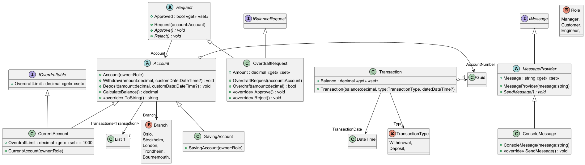

# Domain model

## User stories

- [ ] Must create current account

## Classes

### Transaction

| Method      | Params               | Action | Returns |
|-------------|----------------------|--------|---------|
| Transaction | TransactionType type |        |         |

### Account (abstract class)
| Method   | Params         | Action                       | Returns |
|----------|----------------|------------------------------|---------|
| Account  | Branch branch  |                              |         |
| Withdraw | decimal amount | Withdraws money from account | bool    |
| Deposit  | decimal amount | Deposits money into account  | bool    |
| CalculateBalance|  | Calculate the balance  | void    |
| ToString |                | Returns an account statement |         |

### IOverdraftable (interface)

| Method/variable | Params | Action      | Return  |
|-----------------|--------|-------------|---------|
| OverdraftLimit  |        | Get and set | decimal |

### OverdraftRequest
- Account

| Method           | Params                                     | Action                                               | Returns |
|------------------|--------------------------------------------|------------------------------------------------------|---------|
| OverdraftRequest | ref IOverdraftable account, decimal amount |                                                      | bool    |
| Verdict          | bool approved                              | Approves or rejects a request for an overdraft limit | void    |

### IMessageProvider
Message API is to be determined

| Method | Params                           | Action                      | Returns    |
|--------|----------------------------------|-----------------------------|------------|
| Send   | string recipient, string message | Send a message to recipient | Task<bool> |
|        |                                  |                             |            |

### Branch (enum)

| Method   | Params | Action                           | Return |
|----------|--------|----------------------------------|--------|
| ToString |        | Displays branch name as a string | string |

### TransactionType (enum)
Deposit
Withdrawal

