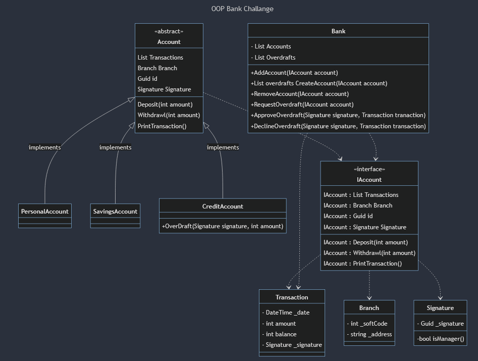

This docucument contains an overview of the bank challange.

### Domain Model
| Classes                     | Properties                               | Methods                                                               | Returns                                                                                    |
|-----------------------------|------------------------------------------|-----------------------------------------------------------------------|--------------------------------------------------------------------------------------------|
| interface IAccount          | List<Transaction> transactions :: Getter | Deposit(int amount) : Transaction                                     | Adds the amount to the balance and returns a transaction                                   |
|                             | Branch branch                            | Withdrawl(int amount) : Transaction                                   | Checks if balance > amount and returns a transaction.                                      |
|                             | Guid Id                                  | GetBalance() : int                                                    | Returns the balance by going through the List of transactions                              |
|                             |                                          | PrintReceipt() : Stringbuilder                                        | Returns a stringbuilder containing a summary of all transactions                           |
| abstract Account : IAccount |                                          |                                                                       |                                                                                            |
|                             |                                          |                                                                       |                                                                                            |
|                             |                                          |                                                                       |                                                                                            |
|                             |                                          |                                                                       |                                                                                            |
| PersonalAccount : Account   |                                          |                                                                       |                                                                                            |
| SavingsAccount: Account     |                                          |                                                                       |                                                                                            |
| Transaction                 | DateTime date :: Getter                  |                                                                       |                                                                                            |
|                             | int amount :: Getter                     |                                                                       |                                                                                            |
|                             | int balance :: Getter                    |                                                                       |                                                                                            |
|                             | Signature signature :: Getter            |                                                                       |                                                                                            |
| Signature                   | Guid signature                           |                                                                       |                                                                                            |
|                             | bool isManager                           |                                                                       |                                                                                            |
| Branch                      | string _address                          |                                                                       |                                                                                            |
|                             | int _sortCode                            |                                                                       |                                                                                            |
| Bank                        | List<Account> accounts                   | AddAccount(Account account) : string                                  | Adds an account to the list, returns "Account added". If not a valid account return reason |
|                             | List<Transaction> overdraft              | RemoveAccount(Account account) : string                               | Removes account if it exists in accounts list                                              |
|                             |                                          | RequestOverdraft(Account account, int amount) : string                | Requests an overdraft if account is CreditAccount                                          |
|                             |                                          | ApproveOverdraft(Signature signature, Transaction tranaction) : bool  | If the signature has isManager = true, approve the transaction, otherwise false.           |
|                             |                                          | DeclineOverdraft(Signature signature, Transaction transaction) : bool | Returns true if the signature has IsManager=true. Does not update the users account.       |

### Class Diagram

### Revised Class Diagram

