This docucument contains an overview of the bank challange.

### Domain Model
| Classes                    | Properties                               | Methods                                                               | Returns                                                                                    |
|----------------------------|------------------------------------------|-----------------------------------------------------------------------|--------------------------------------------------------------------------------------------|
| IAccount                   | List<Transaction> transactions :: Getter | Deposit(int amount) : Transaction                                     | Adds the amount to the balance.                                                            |
|                            | Branch branch :: Getter                  | Withdraw(int amount) : Transaction                                    | Checks if balance > amount, return a Transaction, Otherwise return empty Transaction       |
|                            | Signature signature :: Getter            | PrintReceipt() : Stringbuilder                                        | Goes through all transactions and returns a Stringbuilder with all Transactions.           |
|                            | Guid id :: Getter                        |                                                                       |                                                                                            |
| PersonalAccount : IAccount |                                          |                                                                       |                                                                                            |
| SavingsAccount: IAccount   |                                          |                                                                       |                                                                                            |
| CreditAccount : IAccount   |                                          | OverDraft(Signature signature, int amount)                            |                                                                                            |
| Transaction                | DateTime date :: Getter                  |                                                                       |                                                                                            |
|                            | int amount :: Getter                     |                                                                       |                                                                                            |
|                            | int balance :: Getter                    |                                                                       |                                                                                            |
|                            | Signature signature :: Getter            |                                                                       |                                                                                            |
| Signature                  | Guid signature                           |                                                                       |                                                                                            |
|                            | bool isManager                           |                                                                       |                                                                                            |
| Branch                     | string _address                          |                                                                       |                                                                                            |
|                            | int _sortCode                            |                                                                       |                                                                                            |
| Bank                       | List<Account> accounts                   | AddAccount(Account account) : string                                  | Adds an account to the list, returns "Account added". If not a valid account return reason |
|                            | List<Transaction> overdraft              | RemoveAccount(Account account) : string                               | Removes account if it exists in accounts list                                              |
|                            |                                          | RequestOverdraft(Account account, int amount) : string                | Requests an overdraft if account is CreditAccount                                          |
|                            |                                          | ApproveOverdraft(Signature signature, Transaction tranaction) : bool  | If the signature has isManager = true, approve the transaction, otherwise false.           |
|                            |                                          | DeclineOverdraft(Signature signature, Transaction transaction) : bool | Returns true if the signature has IsManager=true. Does not update the users account.       |                      |

### Class Diagram

