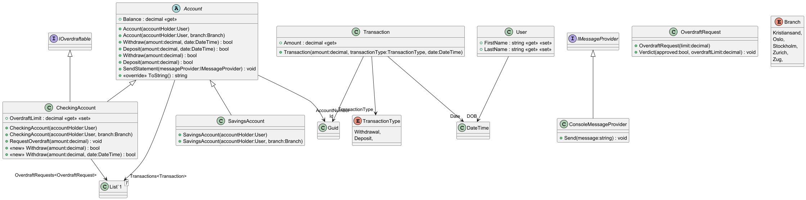

# Domain model

Full class diagram

## User stories

- [x] Must create current account
- [x] Must create savings account
- [x] Must be able to generate bank statements with transaction dates, amounts, and balance at the time of transaction
- [x] Must be able to deposit funds
- [x] Must be able to withdraw funds
- [x] Should be able to calculate balance based on transaction history
- [x] Accounts should be associated with specific branches
- [x] Should be possible to request an overdraft on checking account, NOT savings account
- [x] Should be possible for manager to approve or reject overdraft requests
- [x] Statements should be sent as messages to ~~phone~~ console

## Classes

### Transaction

| Method      | Params               | Action | Returns |
|-------------|----------------------|--------|---------|
| Transaction | TransactionType type |        |         |

### Account (abstract class)
| Method   | Params         | Action                       | Returns |
|----------|----------------|------------------------------|---------|
| Account  | Branch branch  |                              |         |
| Withdraw | decimal amount | Withdraws money from account | bool    |
| Deposit  | decimal amount | Deposits money into account  | bool    |
| ToString |                | Returns an account statement | string  |

### IOverdraftable (interface)

| Method/variable | Params | Action      | Return  |
|-----------------|--------|-------------|---------|
| OverdraftLimit  |        | Get and set | decimal |

### OverdraftRequest
- Account

| Method           | Params                                     | Action                                               | Returns |
|------------------|--------------------------------------------|------------------------------------------------------|---------|
| OverdraftRequest | ref IOverdraftable account, decimal amount |                                                      | bool    |
| Verdict          | bool approved                              | Approves or rejects a request for an overdraft limit | void    |

### IMessageProvider
Message API is to be determined

| Method | Params                           | Action                      | Returns    |
|--------|----------------------------------|-----------------------------|------------|
| Send   | string recipient, string message | Send a message to recipient | Task<bool> |

### Branch (enum)

| Method   | Params | Action                           | Return |
|----------|--------|----------------------------------|--------|
| ToString |        | Displays branch name as a string | string |

### TransactionType (enum)
Deposit
Withdrawal

### User
- Accounts

